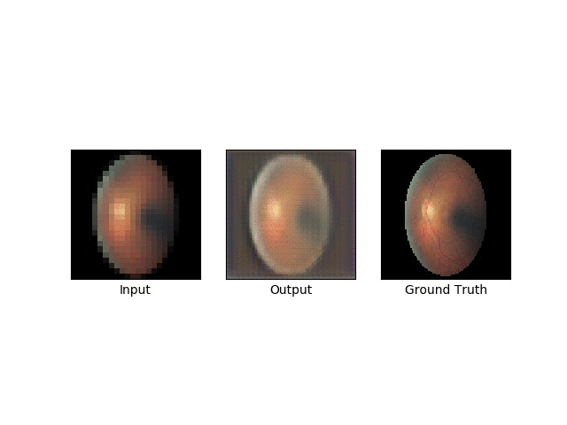
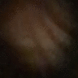
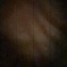
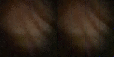

# Retinal Super Resolution using Generative Adversarial Network (SRGAN)

based on 
([Photo-Realistic Single Image Super-Resolution Using a Generative Adversarial Network](
https://arxiv.org/abs/1609.04802))
with TensorFlow.
DataSet: [Google Diabetic retinopathy dataset](https://ai.googleblog.com/2016/11/deep-learning-for-detection-of-diabetic.html)

## Training 

Image shows progression of GAN over 74 epochs. GAN is able to pickup finer details as training progresses

Testing of the GAN using captured raw retinal imagery 

## Test Results

Original Retinal imagery captured by [D-eye](https://www.d-eyecare.com/en_US/product?gclid=EAIaIQobChMI-YKO9Z-N4gIVVrbACh2VzgT1EAAYASAAEgLpw_D_BwE)

SRR Output images

Combined Imagery
