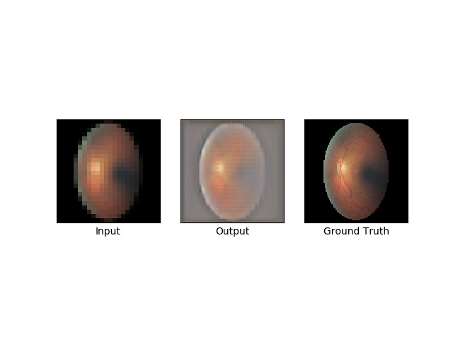

# Retinal Super Resolution using Generative Adversarial Network (SRGAN)

based on 
([Photo-Realistic Single Image Super-Resolution Using a Generative Adversarial Network](
https://arxiv.org/abs/1609.04802))
with TensorFlow.

# Results

## Google Diabetic retinpopathy  training

## Test

The paper says VGG54 is the perceptually most convincing results.
But this implemetation uses all the feature maps generated by every layer
(i.e. phi12, phi22, phi34, phi44, phi54) within the VGG19 network.

